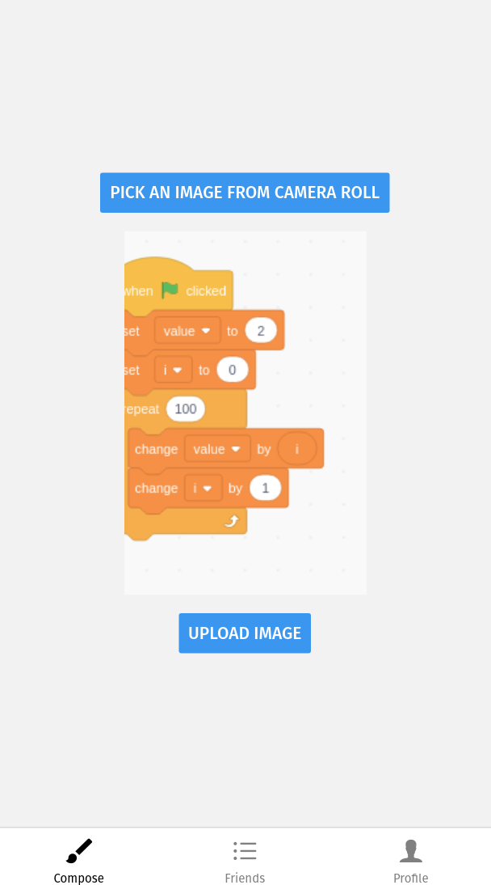

# Print Chat App
[Code for the printer](https://github.com/Nathanllee1/PrinterCode)

A system that allows a user to send messages and images to their friends' thermal printers. This project is an Expo app with a Firebase backend. We're using Adafruit's Mini Thermal Printers with a Raspberry Pi controller.

### Installation
Make sure you have [node.js](https://nodejs.org/en/download/) and [expo cli](https://docs.expo.io/workflow/expo-cli/) installed
```
git clone https://github.com/Nathanllee1/PrintChatApp.git
npm install
expo start
```

#### Website Version: https://nathanllee1.github.io/PrintChatApp/




